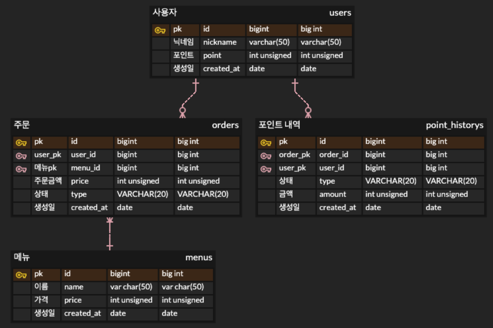

# 목차

1. [API 명세서](#1--커피-주문-시스템-api-명세서)
2. [ERD 명세서](#2-erd-명세서) 
3. [개발 설계 및 기술 서술서](#3--개발-설계-및-기술-서술서)

---

# 1. ☕ 커피 주문 시스템 API 명세서

모든 API의 기본 엔드포인트(Base URL)는 `http://localhost:8080` 입니다.

---

## 1. 회원 관련 API

### 1.1 회원 가입 (Register User)
- **Method**: `POST`
- **URL**: `/user`
- **설명**: 새로운 회원(더미 데이터)를 시스템에 등록합니다.

#### Request
- **Body**: 없음 (기본 파라미터 불필요)

#### Response (200 OK)
```json
{
  "success": true,
  "code": null,
  "message": null,
  "data": null
}
```

---

## 2. 메뉴(커피) 관련 API

### 2.1 커피 메뉴 전체 조회 (Get All Coffees)
- **Method**: `GET`
- **URL**: `/api/coffees`
- **설명**: 등록된 모든 커피 메뉴를 페이징 형태로 조회합니다.

#### Request
- **Query Parameters**:

  | 파라미터명 | 타입 | 필수 여부 | 설명 |
    | :--- | :--- | :--- | :--- |
  | page | Integer | 선택 | 페이지 번호 (0부터 시작) |
  | size | Integer | 선택 | 한 페이지당 노출할 메뉴 개수 |

#### Response (200 OK)
```json
{
  "success": true,
  "code": null,
  "message": null,
  "data": {
    "content": [
      {
        "id": 1,
        "name": "초콜릿티한 카푸치노",
        "price": 3000
      },
      {
        "id": 2,
        "name": "고소한 아메리카노",
        "price": 7000
      },
      {
        "id": 3,
        "name": "고소한 카페모카",
        "price": 7000
      },
      {
        "id": 4,
        "name": "단맛이 있는 카페모카",
        "price": 6000
      },
      {
        "id": 5,
        "name": "산미가 강한 아샷추",
        "price": 6000
      },
      {
        "id": 6,
        "name": "연한 아메리카노",
        "price": 3000
      },
      {
        "id": 7,
        "name": "산미가 강한 롱고",
        "price": 3000
      },
      {
        "id": 8,
        "name": "산미가 강한 카푸치노",
        "price": 9000
      },
      {
        "id": 9,
        "name": "산미가 강한 카페모카",
        "price": 9000
      },
      {
        "id": 10,
        "name": "단맛이 있는 에스프레소",
        "price": 1000
      }
    ],
    "page": 0,
    "size": 10,
    "totalElements": 50001,
    "totalPages": 5001
  }
}
```

### 2.2 최근 7일 인기주문 메뉴 top3
- **Method**: `GET`
- **URL**: `/bulk/coffees/top-ordered`
- **설명**: 최근 7일 top3 메뉴를 조회합니다.

#### Request
- **Body**: 없음

#### Response (200 OK)
```json
{
  "success": true,
  "code": null,
  "message": null,
  "data": [
    {
      "id": 1,
      "name": "프리미엄 아메리카노",
      "price": 7000
    },
    {
      "id": 3,
      "name": "연한 카페라떼",
      "price": 5000
    },
    {
      "id": 2,
      "name": "저렴한 롱고",
      "price": 2000
    }
  ]
}
```

### 2.3 커피 메뉴 대량 등록 (Bulk Create Coffee)
- **Method**: `POST`
- **URL**: `/bulk/coffees`
- **설명**: 데이터 초기화 또는 테스트를 위해 커피 메뉴를 대량으로 일괄 등록합니다.

#### Request
- **Body**: 없음

#### Response (200 OK)
```json
{
  "success": true,
  "code": null,
  "message": null,
  "data": null
}
```

---

## 3. 주문 및 포인트 관련 API

### 3.1 포인트 충전 (Charge Point)
- **Method**: `POST`
- **URL**: `/api/points`
- **설명**: 사용자의 닉네임을 기준으로 포인트를 충전합니다.

#### Request
- **Headers**: `Content-Type: application/json`
- **Body**:

  | 필드명 | 타입 | 필수 여부 | 설명 |
    | :--- | :--- | :--- | :--- |
  | nickname | String | 필수 | 포인트를 충전할 회원 닉네임 |
  | point | Integer | 필수 | 충전할 포인트 금액 |

```json
{
  "nickname": "coffee_lover",
  "point": 10000
}
```

#### Response (200 OK)
```json
{
  "success": true,
  "code": null,
  "message": null,
  "data": null
}
```

### 3.2 주문 생성 (Create Order)
- **Method**: `POST`
- **URL**: `/api/orders`
- **설명**: 회원이 특정 커피 상품을 주문합니다.

#### Request
- **Headers**: `Content-Type: application/json`
- **Body**:

  | 필드명 | 타입 | 필수 여부 | 설명 |
    | :--- | :--- | :--- | :--- |
  | id | Long | 필수 | 주문할 커피 메뉴의 ID |
  | nickname | String | 필수 | 주문하는 회원 닉네임 |

```json
{
  "id": 1,
  "nickname": "coffee_lover"
}
```

#### Response (200 OK)
```json
{
  "success": true,
  "code": null,
  "message": null,
  "data": {
    "id": 1,
    "nickname": "BOB",
    "price": 3000,
    "type": "COMPLETE"
  }
}
```

---

# 2. ERD 명세서



## 관계

| 관계                         | 설명                           |
|----------------------------|------------------------------|
| users 1 : N point_historys | 사용자는 포인트를 충전하고 포인트를 사용할 수 있음 |
| users 1 : N orders         | 사용자는 어려번 주문을 할 수 있음          |
| orders N : 1 menus         | 주문에 1개 이상의 메뉴가 담김            |

---

## 3. 🏗️ 개발 설계 및 기술 서술서

### 1. 설계의 의도
- **일관된 응답 표준화**: 프론트엔드 및 클라이언트와의 원활한 협업을 위해 모든 API 응답을 `ApiResponse<T>`라는 공통 포맷으로 감싸 성공/실패 여부와 에러 코드를 일관되게 전달하도록 설계했습니다.
- **도메인 기반 분리**: 비즈니스 확장성을 고려하여 회원, 메뉴(Coffee), 주문 및 포인트(Order/PointHistory) 도메인을 명확히 분리하고 엔드포인트를 계층적으로 구성했습니다.
- **관심사의 분리 및 재사용성 극대화 (람다 기반 락 템플릿)**:
  비즈니스 로직 내부마다 분산 락을 획득하고 해제(`try-catch-finally`)하는 인프라 코드가 중복 삽입되면 가독성이 떨어지고 유지보수가 어려워집니다. 이를 해결하기 위해 함수형 인터페이스(`Supplier<T>`, `Runnable`)를 활용한 공통 락 관리 클래스(`LockDistributeService`)를 설계했습니다. 이를 통해 비즈니스 로직은 핵심 요구사항에만 집중하고, 락 제어 로직은 단 한 곳에서 선언적으로 처리하도록 결합도를 낮추었습니다.

### 2. 선택한 문제해결 전략 및 분석 내용
- **조회 성능 최적화 (페이징)**: 메뉴 전체 조회 시 발생할 수 있는 대량 데이터 로딩 문제를 분석하여, Spring Data JPA의 `Pageable`을 도입해 오프셋 기반 페이징으로 네트워킹 부하를 줄였고 `캐시`를 이용하여 자주 요청하는 데이터에 대한 응답 속도 향상을 시켰습니다.
- **대량 등록 데이터 처리 (`/bulk/coffees`)**: 대량의 더미 데이터를 삽입할 때 I/O 병목을 우려하여, 배치(Batch) 인서트 전략을 염두에 둔 대량 등록 전용 엔드포인트를 구축했습니다.
- **포인트 및 주문 정합성**: 포인트 충전과 주문 및 포인트 차감의 경우 데이터 유실이나 꼬임 현상을 방지하기 위해 트랜잭션(`@Transactional`)의 격리 수준을 고려하여 반영했습니다.
- **포인트 동시성 제어**: 동일 사용자가 동시에 여러 기기에서 포인트를 충전하거나 주문 차감을 시도할 경우, Race Condition으로 인해 데이터 정합성이 깨지는 동시성 문제를 분석했습니다. 이를 해결하기 위해 유저의 `nickname`을 고유한 Key로 지정하여 요청이 들어올 때마다 Lock을 획득하도록 제어함으로써 데이터 무결성을 보장했습니다.

### 3. 기술적 선택 이유
- **Redisson (Redis Distributed Lock) 선택**:
  동시성 제어를 위해 DB 레벨의 낙관적/비관적 락을 사용할 수도 있었으나, 데이터베이스 커넥션 풀의 고갈 문제를 막고 분산 환경(Scale-out)에서의 확장성을 확보하기 위해 외부 분산 락(Distributed Lock)을 선택했습니다. 특히 Lettuce 방식의 스핀 락(Spin Lock)은 지속적인 락 획득 시도로 인해 Redis에 부하를 주지만, **Redisson은 Pub/Sub 기반으로 작동하여 Redis 서버의 부하를 최소화**하고 내장된 `tryLock(timeout)` 기능으로 락 데드락 및 타임아웃을 안전하게 제어할 수 있어 선택했습니다.
- **Redis Cache 선택**:
  애플리케이션 로컬 캐시(Ehcache 등)는 서버가 스케일아웃 될 때 서버 간 캐시 불일치(Cache Invalidation) 문제가 발생합니다. 따라서 모든 서버 인스턴스가 동일한 상태의 데이터를 빠르게 공유하고 참조할 수 있도록 글로벌 인메모리 데이터 저장소인 **Redis를 중앙 집중형 캐시 스토리지로 선택**했습니다.
- **Springdoc OpenAPI (Swagger)**: 개발 생산성을 높이고 수동 문서 작성의 휴먼 에러를 방지하고자 코드를 기반으로 실시간 테스트가 가능한 자동 문서화 도구를 선택했습니다.
